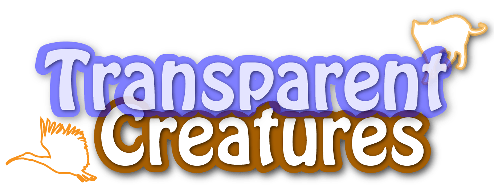

# TransparentCreatures

(https://www.youtube.com/watch?v=G5rULR53uMk)
## 製品概要
### Event × Tech
### 背景
- VRとリアルイベントの流行
    - Virtual Realityと呼ばれる，コンピュータでつくられた仮想の空間を用いて遊ぶエンタメが流行している (ex. VR Zone，　PSVR)
    - 一方で， リアルイベントと呼ばれる，その場に来て遊ぶ体験型のイベントが流行している (ex. リアル脱出ゲーム，Team Lab)
    - 一見すると真逆の遊びに見えるが，双方の良いところを取り入れた，"仮想の自由度を持ちつつ現実の場で遊べるイベント"を作りたい
- それぞれの利点
    - VR:現実ではあり得ない現象ような仮想のキャラクタ，演出，場所，様々な表現が可能
    - リアルイベント：その場にいる友達や家族と一緒に体験できる

    ここにスライド1

### 課題
- 課題と方向性
    - VR は仮想の空間に没入するため自由度が高いが，一人で遊ぶもの
    - リアルイベントは大掛かりな舞台や小道具などの設置が必要である
    - それぞれの利点を損なわない範囲で，VRとリアルイベントを掛け合わせたものを作る
- 理想
    - "みんなであそべる"VRの新しい形

### 製品説明（具体的な製品の説明）
- 「TransparentCreatures」は，目に見えない生き物や物体を探して遊ぶVR宝探しゲームです．
- ユーザは手に持ったコントローラを使って，空間内を動き回ります
- コントローラから動物の鳴き声や物音がするので，その方向に近づくと音が大きくなっていきます
- 生き物のいる場所にぶつかると音が鳴り，その場所に生き物がいることがわかります
- 肉眼では見えないにも関わらず，他の場所にはいないのに，そこにコントローラを当てると鳴き声がするという不思議な体験が可能です．
- また，生き物を捕まえ，ゴール地点に持っていくと，設置されたモニタに捕まえた生き物の姿が映ります．
- 制限時間内にたくさんの生き物を探したり，指定された生き物を探して，他のプレイヤーと一緒に遊び場を動き回りましょう．
### 特長
#### 1. 特長1
- 音だけで遊ぶ，みんなで遊ぶVR
    - スマホ端末やHMDを使うことなく，与えられたコントローラから鳴る音を頼りに遊びます．
    - リアルなその場が遊ぶ場となることで，友達や家族といった他のプレイヤーと一緒に遊ぶことができます
#### 2. 特徴2
- 見えないものがそこにあるという感覚
    - 追跡用のコントローラが見えない生き物たちにぶつかると，衝突した音や生き物の鳴き声がコントローラから聞こえます．
    - 音，振動，見えないけれど確かにそこになにかがあるという感覚が生まれます．
    - GPSやBluthoothを用いた大まかな宝探しではなく，本当にXYZ座標でしか鳴らない臨場感があります．

#### 3. 特長3
- 言語いらずの遊び
    - 音の感覚や，場所の移動を中心に遊ぶため，ルールがシンプルで，すぐに把握できます．
    - 外国人や，視覚に障害がある方でも遊ぶことができます．
### 解決出来ること
- VRの独立性の解消
    - 音さえ聴こえれば誰でもその場にいれば遊ぶことができ，共通のVR体験が可能です．
    - みんなで遊ぶリアルな場を尊重しつつ， 現実だけではありえないVRの良さを取り入れています．
- 舞台装置に頼らないリアルイベント
    - 舞台装置をいくつも用意することなく，演出が可能です．仮想空間の作り込みがそのまま現実空間に反映されます．
    - また，これまでの脱出ゲームといった作り込んだ舞台にそのまま適用することも可能です．

### 今後の展望
- たくさんのプレイヤーが遊ぶことができる
    - 広い空間にセンサを設置し，コントローラも複数用意することで，たくさんのプレイヤーが一斉に遊ぶことができる
    - 家族づれや学生の団体客が来るアミューズメント施設などへの導入を想定．
- 感覚の臨場感を更に向上
    - 見えない生物に触れた時の音や振動を更に細かなものに変更することで， 実物のように感じるVR要素を強化する．
    - 体験型展示における外国人観光客や視覚障害者に伝わりやすい技術としての応用を想定．
- コンテンツのブラッシュアップ
    - 遊びやすいゲームルールやキャラクタを考案することでより楽しいゲームにする．
    - コントローラの操作性や安全性を高めることで子どもから大人まで扱いやすくする．
## 開発内容・開発技術

### 活用した技術
#### ゲームエンジン(言語)
* Unity(C#)
    * ゲームエンジンであるUnityを用いてVR空間の構築やオブジェクトの衝突判定，音の制御などを行なっています．
#### デバイス
* HTC Vive， ViveTracker， ベーススーテション
    * 本プロダクトにはVR HMDであるHTC Viveと，トラッキングデバイスであるベーススーテション，ViveTrackerを用いています．
#### ライブラリ
* SteamVR
    * HTC Viveの制御に用いています．赤外トラッキング装置である「ベーススーテション」を用いてユーザのコントローラ位置・角度を高精度に取得します．
* Photon
    * スマートフォンとの連動にオンラインゲーム通信ライブラリである「Photon」を用いています．
### 研究内容・事前開発プロダクト（任意）
* 修士論文(執筆・実装中)「Afterglow Projection」
    * https://www.youtube.com/watch?v=EM2LGNqjgWY
    * 実空間と仮想空間を融合した作品として開発したものです．
    * 今回のプロダクトと近いコンセプトや技術が用いれられています．
### 独自開発技術（Hack Dayで開発したもの）
#### 2日間に開発した独自の機能・技術
* スマートフォンの高精度な位置・角度検出
    * 「SteamVR」のトラッキングで得た座標を 「Photon」を用いて送信することで， 本来VR機器を接続することができないスマートフォン端末でも高精度な位置・角度検出を利用することが可能です．
* コントローラの入出力
    * 自作の筐体に組み込まれたボタンを押して操作することができます
